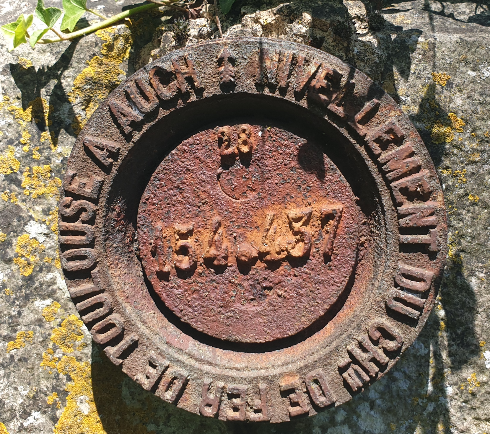

# Géodésie de Bureau

>[!Important]
> Bien que le nom de «&nbsp;Géodésie de Bureau&nbsp;» soit directement inspiré
> de celui de l’application
> «&nbsp;[Géodésie de Poche](https://geodesie.ign.fr/index.php?page=geodesie-poche)&nbsp;»
> de l’IGN/Géoportail,
> ce programme **n’est affilié en aucune façon à l’Institut National de
> l’Information Géographique et Forestière (IGN) ni au Géoportail**. Ce programme
> n’a pas pour but non plus de s’approprier la propriété intellectuelle de l’IGN
> ou du Géoportail.

>[!Note]
> Ce programme est dans les premières phases de développement

Géodésie de Bureau – gardez une liste des [repères de nivellement](https://geodesie.ign.fr/index.php?page=reperes_de_nivellement) que vous avez vus&nbsp;!

## Fonctionnalités
Le but de ce programme sera de pouvoir rentrer les données d’un repère (ou d’automatiquement récupérer sa fiche dans le cas d’un repère NGF), et de pouvoir lier ce repère à des visites et des photos.

Il sera ensuite possible d’exporter la BDD en [geojson](https://geojson.org) pour afficher les repères sur une carte.
